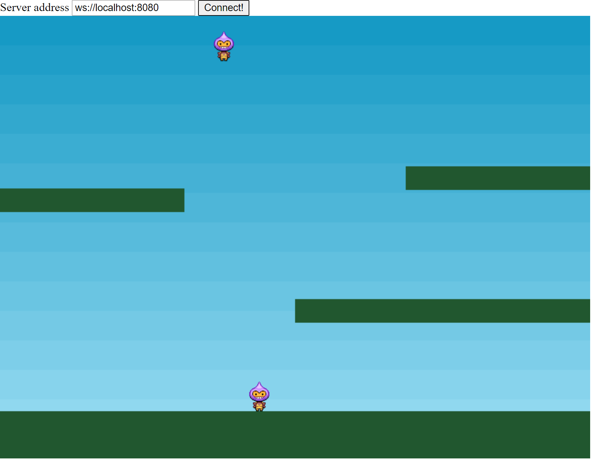

# Rua Platformer

A simplest H5 multiplayer game using [Phaser 3](https://phaser.io/) as the client framework and [Rua](https://github.com/DiscreteTom/rua) as the server framework.

The client code and assets are based on the official [Phaser 3 demo](https://phaser.io/tutorials/making-your-first-phaser-3-game/index).

## Getting Started

### Server

1. Install Go 1.17.
2. Run `go run main.go` in the `server` folder.

### Client

Use a web server (e.g. [Web Server for Chrome](https://chrome.google.com/webstore/detail/web-server-for-chrome/ofhbbkphhbklhfoeikjpcbhemlocgigb/)) to serve the `client` folder.

Access the `main.html` to play the game. Enter the server address to join a game.

